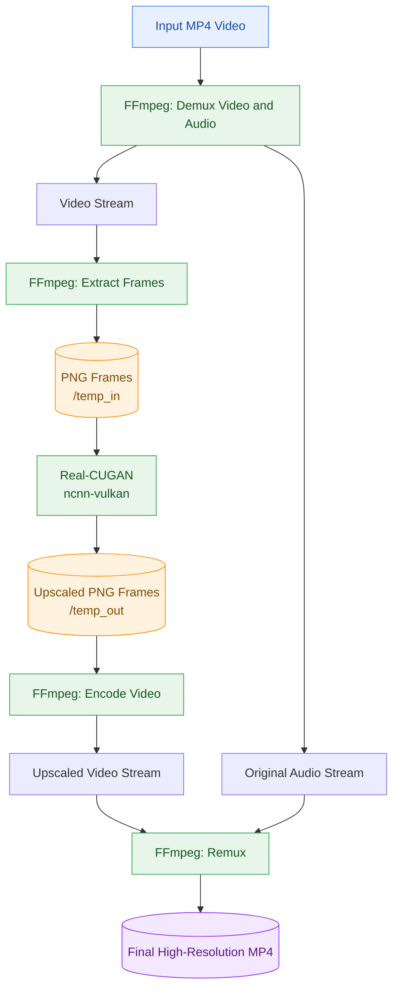

# Ramayana Anime AI Upscaler (Real-CUGAN + Vulkan)

An end-to-end Python pipeline for upscaling classic anime videos using **Real-CUGAN, Vulkan GPU acceleration, and FFmpeg**. Designed to run on Google Colab or Kaggle GPU runtimes, including the NVIDIA Tesla T4.

## 📌 Overview

*Ramayana: The Legend of Prince Rama* (1992) is a classic animated film whose digital copies may contain low-resolution frames, compression artifacts, and visual noise.

This project provides a Google Colab/Kaggle notebook, [`Upscale_Video.ipynb`](Upscale_Video.ipynb), that uses **Real-CUGAN (Real-World Compact Ubiquitous Generative Adversarial Networks)** to enhance anime frames while preserving linework, colors, and visual details.

The pipeline extracts video frames, upscales them using `ncnn-vulkan`, and reconstructs the video with FFmpeg while retaining the original audio stream.

### ✨ Key Features

* **GPU-accelerated upscaling:** Uses Real-CUGAN with `ncnn-vulkan` and Vulkan support on compatible GPU runtimes.
* **Configurable resolution:** Supports 2×, 3×, and 4× upscaling.
* **Adjustable denoising:** Configure noise reduction based on the quality of the source video.
* **Isolated environment:** Uses a Python 3.10 virtual environment to reduce dependency conflicts.
* **Audio preservation:** Retains the original audio stream without re-encoding it during remuxing.
* **Lossless intermediate frames:** Uses PNG images for frame extraction and processing.
* **Efficient processing:** Uses configurable threading to balance frame processing and video encoding.

## 🏗️ Pipeline Architecture

The pipeline separates video processing from audio preservation. Video frames pass through the Real-CUGAN upscaler, while the original audio is retained for the final remuxing stage.



### Processing stages

1. **Input:** Load the source MP4 video.
2. **Demuxing:** Separate the video and audio streams.
3. **Frame extraction:** Extract video frames as PNG images using FFmpeg.
4. **AI upscaling:** Process each frame using Real-CUGAN with Vulkan acceleration.
5. **Video reconstruction:** Encode the upscaled frames into a high-resolution video stream.
6. **Audio remuxing:** Combine the reconstructed video with the original audio stream.
7. **Output:** Produce the final upscaled MP4 video.

## 🚀 Quick Start

### 1. Launch the notebook

1. Upload `Upscale_Video.ipynb` to [Google Colab](https://colab.research.google.com/) or [Kaggle](https://www.kaggle.com/code).
2. Select a GPU runtime, such as an NVIDIA Tesla T4.
3. Upload your source video or configure `INPUT_PATH` to point to the video file.
4. Run the notebook cells in order.
5. Retrieve the generated upscaled video from the configured output path.

> **Note:** GPU availability, Vulkan driver configuration, disk space, and session time limits depend on the runtime environment.

### 2. Configure upscaling

In Section 3 of the notebook, adjust the parameters to suit your source video.

```python
UPSCALE_RATIO = "2"  # Options: "2", "3", "4"
DENOISE_LEVEL = "0"  # Options: "-1", "0", "1", "2", "3"
```

| Parameter       | Description                                                   |
| --------------- | ------------------------------------------------------------- |
| `UPSCALE_RATIO` | Output scaling factor: 2×, 3×, or 4×                          |
| `DENOISE_LEVEL` | Denoising strength supported by the selected Real-CUGAN model |

Higher upscaling ratios increase processing time and storage requirements. Results depend on the source quality and selected model.

## 🎬 Working with Long Videos

### Split a movie into smaller chunks

For feature-length movies, processing shorter segments can help manage disk usage and reduce the risk of runtime timeouts.

The following command splits a video into one-minute segments **without re-encoding the streams**:

```bash
ffmpeg -i movie.mp4 \
  -map 0 -c copy \
  -f segment \
  -segment_time 00:01:00 \
  -reset_timestamps 1 \
  chunk_%04d.mp4
```

**Important:** Stream-copy segmentation cuts at suitable packet/keyframe boundaries, so segments may not be exactly one minute long.

Process each chunk separately, then concatenate the outputs in their original order. Ensure the chunks use compatible encoding parameters before concatenation.

### Generate a side-by-side comparison video

Compare the original and upscaled results in a single video with labels.

```bash
ffmpeg -i original.mp4 -i upscaled.mp4 \
  -filter_complex "
    [0:v]drawtext=text='Original':
      x=20:y=20:fontsize=28:fontcolor=white:
      box=1:boxcolor=black@0.6[v0];
    [1:v]drawtext=text='Real-CUGAN 2x':
      x=20:y=20:fontsize=28:fontcolor=white:
      box=1:boxcolor=black@0.6[v1];
    [v0][v1]hstack=inputs=2[v]
  " \
  -map "[v]" -map 1:a? \
  -c:v libx264 -crf 18 \
  -c:a copy \
  comparison_side_by_side.mp4
```

This produces a horizontally stacked comparison with the original on the left and the upscaled version on the right.

**Requirements:** Both inputs should have compatible heights, frame rates, and pixel formats for `hstack`. If necessary, normalize their dimensions using FFmpeg filters. The example also assumes a compatible audio stream in the upscaled input.

## 📁 Repository Structure

```text
ramayana-anime-ai-upscaler/
├── Upscale_Video.ipynb    # Main processing notebook
├── README.md              # Project documentation
└── samples/               # Optional comparison clips and screenshots
```

## 🧰 Tech Stack

| Component           | Technology             |
| ------------------- | ---------------------- |
| AI upscaling        | Real-CUGAN             |
| GPU acceleration    | Vulkan / `ncnn-vulkan` |
| Video processing    | FFmpeg and FFprobe     |
| Runtime environment | Python 3.10            |
| Execution platform  | Google Colab / Kaggle  |
| GPU example         | NVIDIA Tesla T4        |

The notebook handles environment setup, dependency installation, Vulkan configuration, frame processing, and video reconstruction.

## ⚖️ Disclaimer

This project is intended for educational, archival, and non-commercial personal research. All rights to *Ramayana: The Legend of Prince Rama* belong to their respective creators and copyright holders. This repository does not claim ownership of the film or its underlying assets.

Users are responsible for ensuring they have the necessary rights or permissions to process, reproduce, and distribute any video content. Do not distribute copyrighted video assets without authorization.
